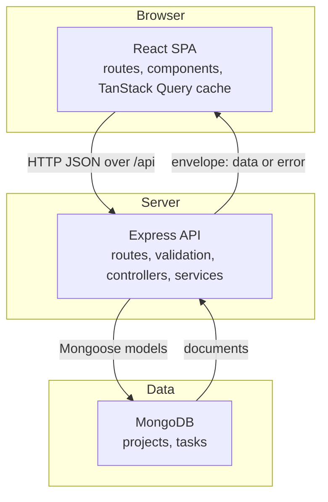
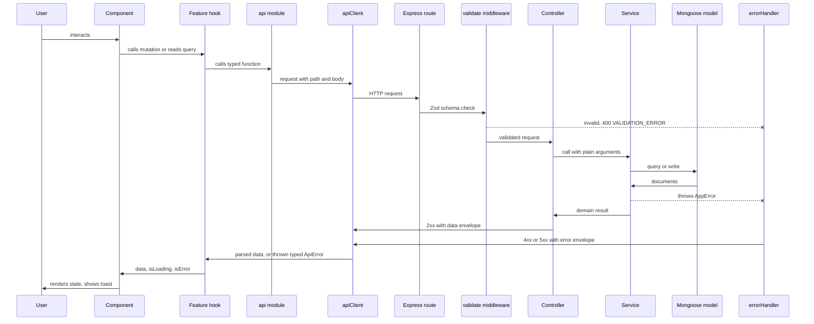

# TaskFlow — Architecture

Related steering: reference `#tech-stack` for the libraries named here, `#structure` for the exact folder and file layout, `#api-standards` for endpoint and payload detail, `#product` for the domain vocabulary and required flows.

## The three layers



The database is the source of truth. The frontend holds a cache of server state, never an authoritative copy. Any project or task change travels frontend → API → database, and the frontend updates from what the API returns rather than from what it optimistically assumed.

## Request lifecycle



## Frontend layers

Data flows in one direction: route → feature component → hook → api module → HTTP.

**Routes** map a URL to a page component and own nothing else. Route definitions live in `routes/`. Layout chrome (sidebar, top bar) wraps them once, not per page.

**Feature components** render UI and handle user intent. They read data from hooks and call mutations from hooks. A component never calls `fetch`, never constructs a URL, never touches the query cache directly.

**Feature hooks** wrap TanStack Query. Each hook owns one query key or one mutation, including its cache invalidation. This is where "what needs refreshing after this change" is decided, once, instead of at every call site.

**Feature api modules** are the only place that names an endpoint. Each exports typed functions such as `listTasks(params)` or `updateTaskStatus(id, status)` that call the shared client and return typed domain objects.

**`lib/apiClient.ts`** is the single HTTP boundary. It applies the base URL, sets JSON headers, unwraps the `{ data }` envelope on success, and on failure throws a typed `ApiError` carrying the error `code`, `message`, and any field `details`. Nothing above it ever sees a raw `Response`.

## Backend layers

Data flows in one direction: route → validate middleware → controller → service → model.

**Routes** declare method, path, the validation schema, and the controller. No logic.

**Validate middleware** runs a Zod schema against `body`, `params`, and `query`, replaces them with the parsed and coerced result, and rejects with a 400 before any controller runs. A controller can therefore trust its input completely.

**Controllers** are thin adapters between HTTP and the domain. Read validated input, call exactly one service function, send the response with the right status code. No queries, no computation, no business rules.

**Services** hold all business logic and all database access. They receive plain arguments, return plain domain objects, and throw `AppError` for domain failures such as a missing project. This is where cascade deletes, statistics aggregation, filter and sort construction, and the project-exists check live.

**Models** are Mongoose schemas: field types, required fields, enum constraints, indexes, `timestamps: true`, and a `toJSON` transform that exposes `id` and strips `_id` and `__v`.

**errorHandler** is the last middleware. It converts anything thrown anywhere into the standard error envelope. See `#api-standards` for the exact shape.

## Boundary rules

Stated as absolutes so they can be checked in review.

Backend:

1. A controller never imports a Mongoose model. If a controller file references `Project` or `Task` directly, that logic belongs in a service.
2. A service never touches `req`, `res`, or `next`, and never sets a status code. Services are callable from a test or a script with no HTTP involved.
3. A route file contains no logic beyond wiring method, path, middleware, and controller.
4. Validation happens only in middleware, via Zod, before the controller. Controllers never re-check required fields.
5. Only `src/config/env.ts` reads `process.env`.
6. Domain failures throw `AppError`. Never send an error response from inside a service, and never swallow an error to return `null` where the caller cannot distinguish "not found" from "empty".
7. One module owns one resource. Cross-resource work belongs in the service of the resource that owns the operation: deleting a project's tasks is the project service's job, calling the task model directly.

Frontend:

1. A component never calls `fetch` or `apiClient` directly. It goes through a feature hook.
2. A feature never imports from a sibling feature, with one sanctioned exception: the project detail page renders the task list and the create-task dialog from the tasks feature, because PRD §10 requires project details to show its tasks and offer creating one from there. That page is the one place this crosses. For every other case, if `tasks` and `projects` both need something, it moves to `components/ui`, `lib`, `hooks`, or `types`.
3. Shared presentational primitives live in `components/ui` and contain no data fetching and no domain knowledge. A `Badge` does not know what a task status is; the caller passes it a variant.
4. Domain types live in `types/` and are imported. Never redeclare a `Task` or `Project` shape inline, and never define a second competing version of one in a feature folder.
5. Status and priority display labels come from the single label map. No hardcoded `"In Progress"` string in a component. See `#product` for the value tables.
6. Filter, search, sort, and view-mode state lives in the URL. Never mirror it into component state as a second source of truth.

## State ownership

Every piece of state has exactly one home. If you are unsure where something belongs, it belongs to whichever row below describes it; if none do, ask before inventing a new mechanism.

| State | Owner | Notes |
|---|---|---|
| Projects, tasks, dashboard data | TanStack Query | Server state. Includes loading and error status. Never copied into `useState`. |
| Form field values, touched state, field errors | React Hook Form | Includes server validation errors, mapped onto fields by name from the error `details`. |
| Active filters, search term, sort field and direction, list-vs-board view | URL search params | Makes views shareable and refresh-safe, and gives back and forward navigation for free. |
| Which modal or dialog is open, hover and focus, expanded rows | Local `useState` | Ephemeral UI only. Dies with the component. |
| Toast queue | Toast provider context | Write-only from callers; they fire a toast and forget it. |
| Current route | React Router | Read via router hooks, never duplicated. |

Nothing else. There is no global store, and no cross-component event bus.

## Query keys and cache invalidation

Keys are hierarchical arrays so a broad invalidation catches its narrower descendants:

```
['projects']                        list
['projects', id]                    one project
['projects', id, 'tasks']           that project's tasks
['tasks', filters]                  filtered list, filters object part of the key
['tasks', id]                       one task
['dashboard']                       summary, stats, recent, upcoming
```

Because task changes shift project counts and dashboard statistics, invalidation must reach further than the entity that changed. Each mutation invalidates exactly this set:

| Mutation | Invalidates |
|---|---|
| Create project | `['projects']`, `['dashboard']` |
| Update project | `['projects']`, `['projects', id]`, `['dashboard']` |
| Delete project | `['projects']`, `['tasks']`, `['dashboard']` — its tasks are gone too |
| Create task | `['tasks']`, `['projects']`, `['projects', projectId]`, `['dashboard']` |
| Update task | `['tasks']`, `['tasks', id]`, `['projects']`, `['dashboard']`; if the project changed, both the old and the new `['projects', projectId]` |
| Change task status | `['tasks']`, `['tasks', id]`, `['projects']`, `['projects', projectId]`, `['dashboard']` |
| Delete task | `['tasks']`, `['projects']`, `['projects', projectId]`, `['dashboard']` |

The status-change row is what makes required flow 4 work: completing a task must visibly update the task list, the board, the project's completed count, and the dashboard counters. Project list entries carry task totals, so `['projects']` is invalidated on every task mutation, not just on project edits.

Optimistic updates are permitted for the board drag interaction only, because the latency there is most visible. If used, the mutation must roll back on error and must still invalidate on settle. Everywhere else, wait for the server response.

## Error propagation

One path, end to end:

1. A service detects a domain failure and throws `AppError` with an HTTP status, a machine-readable `code`, and a human-readable message. Example: a task create naming a project that does not exist throws 404 `NOT_FOUND`.
2. Validate middleware rejects a bad request as 400 `VALIDATION_ERROR`, with per-field `details`.
3. Unexpected throws — a Mongoose failure, a bug, a lost connection — reach the same handler unmodified.
4. `errorHandler` maps whatever it receives to the standard envelope. Known `AppError`s keep their status, code, and message. Anything else becomes 500 `INTERNAL_ERROR` with a generic message; the real error is logged server-side and never returned to the client.
5. `apiClient` sees a non-2xx response, parses the envelope, and throws a typed `ApiError`.
6. The calling hook surfaces it as TanStack Query's `isError` and `error`.
7. The component decides how to present it: a form maps `details` onto its fields and shows the rest as a form-level message; a page shows an inline error state with a retry; a mutation outside a form shows an error toast. A network failure with no response is presented as a connection problem, distinct from a server rejection.

No layer both handles an error and rethrows it. No layer logs an error it is going to rethrow.

## Where each PRD flow lands

| Flow | Path through the system |
|---|---|
| Create project | Projects page → create dialog → `useCreateProject` → `POST /api/projects` → validate → controller → service → model → invalidate projects and dashboard |
| Create task | Project detail or Tasks page → create dialog → `useCreateTask` → `POST /api/tasks` → validate → service checks project exists → model → invalidate tasks, projects, dashboard |
| Update task | Task detail → edit form → `useUpdateTask` → `PATCH /api/tasks/:id` → partial update → invalidate task, tasks, projects, dashboard |
| Complete task | List or board → `useUpdateTaskStatus` → `PATCH /api/tasks/:id/status` → invalidate tasks, task, projects, project, dashboard |
| Search and filter | Tasks page writes URL params → `['tasks', filters]` query → `GET /api/tasks?...` → service builds query and sort → results |
| Delete task | Confirm dialog → `useDeleteTask` → `DELETE /api/tasks/:id` → 204 → invalidate tasks, projects, dashboard |
| Persistent data | Every read comes from MongoDB through the API; nothing authoritative is held in the browser |
